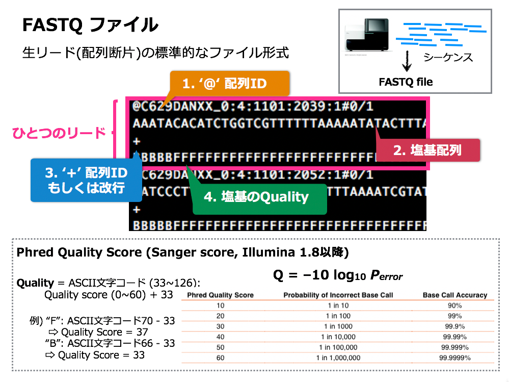
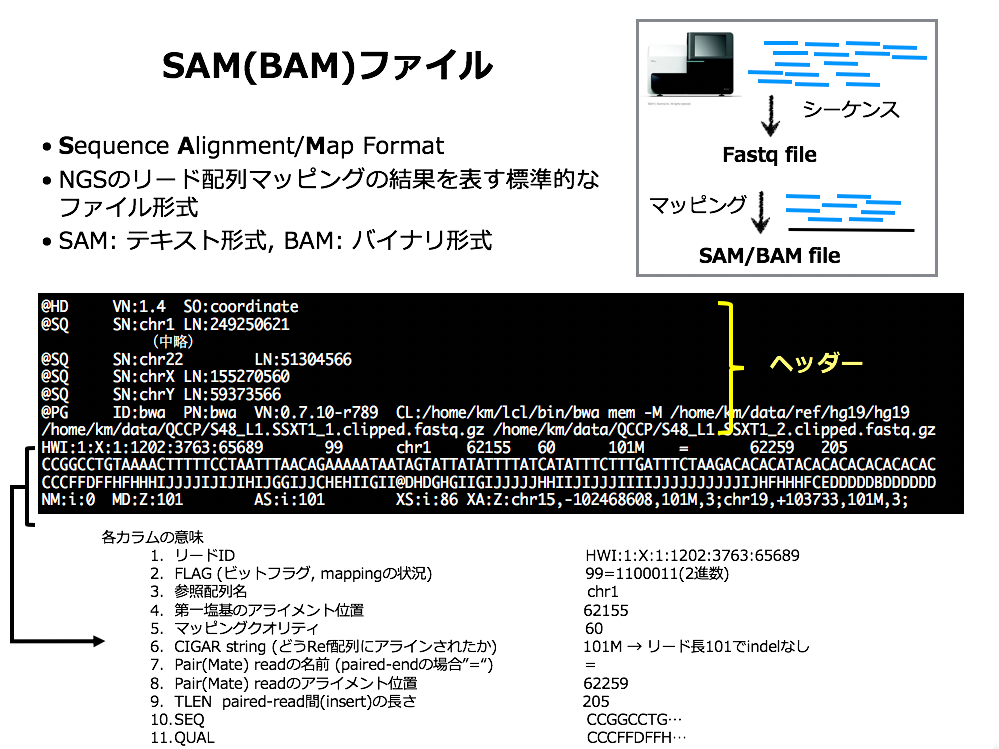

# ゲノムのマッピング

## BWAを用いてリードを参照配列にマッピング

[BWA](http://bio-bwa.sourceforge.net/)は、Burrows-Wheeler Transformation アルゴリズムを用いた高速な配列マッピングを実現しています。Illuminaシーケンサーのショートリードについては様々なマッピングツールがありますが、比較するとMinIONなどのロングリードに対応したツールはまだ少なめです。

`bwa`コマンドは広く使われており十分に高速なのですが、他にも産総研の[LAST](http://last.cbrc.jp/)もロングリードに対応しているほか、東大で開発されている[minialign](https://github.com/ocxtal/minialign)はより高速で正確と謳われており、国内のバイオインフォマティクス研究者の活躍にも期待したいところです。

### BWAコマンドの使い方

`bwa`でMinIONのロングリードをマッピングするには、サブコマンド`bwasw`を利用します。コマンドラインオプションは下記のようになります。

```sh
bwa bwasw リファレンス配列名 入力FASTQファイル > 出力SAMファイル
```

マッピング対象とするリファレンス配列は、あらかじめ準備しておく必要があります。今回は、デスクトップの、GenomeBentoの中のdatabasesフォルダ以下に置いてあります。

```
GenomeBento/databases
|-- genomes
|   |-- banana
|   |-- cabbage
|   |-- carrot
|   |-- chickpea
|   |-- hakusai
|   |-- human
|   |-- rice
|   `-- tomato
`-- rbcL
    |-- rbcL_all
    `-- rbcL_bento
```

実際はそれぞれ、`.amb`, `.ann`, `.bwt`, `.pac`, `.sa` の拡張子がついたファイルの組になります。

#### リファレンス配列の準備

（ここは読み飛ばして構いません）

自分でリファレンス配列のファイルを作る場合は、ゲノム弁当の[食材の追加方法](AdditionalGenomeBento.md)で紹介したように、たとえばNCBI Genomeなどでゲノム配列データのIDを取得します。


ただし、[ココ](https://www.ncbi.nlm.nih.gov/genome/63)の「各染色体のDNA配列データへのリンク」をクリックした先にあるトラフグの[染色体１番](https://www.ncbi.nlm.nih.gov/nuccore/NC_018890.1)のRefSeqデータベースエントリ`NC_018890.1`には、ゲノム配列自体は含まれていません。


左上の「FASTA」と書かれたリンクをクリックすると配列データをダウンロードできます。トラフグの全ゲノムを取得するには、この操作を全ての染色体の数ほど繰り返して一つのファイルにまとめます。この作業はちょっと面倒なので、たとえば拙作の[TogoWS](http://togows.org/)を使って工夫してみます。

```sh
for id in NC_018890.1 NC_018891.1 NC_018892.1 NC_018893.1 NC_018894.1 NC_018895.1 NC_018896.1 NC_018897.1 NC_018898.1 NC_018899.1 NC_018900.1 NC_018901.1 NC_018902.1 NC_018903.1 NC_018904.1 NC_018905.1 NC_018906.1 NC_018907.1 NC_018908.1 NC_018909.1 NC_018910.1 NC_018911.1 NC_004299.1
do
  curl http://togows.org/entry/nucleotide/${id}.fasta >> 31033-torafugu.fasta
done
```

少し時間がかかりますが、これで指定したトラフグの各染色体のゲノムDNA配列がすべて一発で`31033-torafugu.fasta`ファイルにFASTA形式でダウンロードできます。

ゲノム配列が入ったFASTAファイルに対し、`bwa index`コマンドを用いてインデックスを作ります。このとき`-p`オプションで`bwa bwasw`にオプションで渡すリファレンス配列名を指定します（FASTAファイル名、リファレンス配列名は自由に決めて構いません）。

```sh
bwa index -p torafugu 31033-torafugu.fasta
```

このようにして作ったのが、今回ゲノム弁当の解析用に用意した上記の`banana`, `cabbage`, `carrot`, `chickpea`, `hakusai`, `rice`, `tomato`などになります。なお、`human`に関しては東北メディカル・メガバンク機構から[2019年2月25日に公開されたばかり](https://www.megabank.tohoku.ac.jp/news/32217)の[日本人のリファレンスゲノム配列JG1](https://jmorp.megabank.tohoku.ac.jp/201902/downloads/)です。実験の途中に間違って自分のDNAが入ってしまって（コンタミして）いないか、確認のために使うことができると思います。

## リファレンス配列へのマッピング

今回のゲノム弁当からMinIONで読んだDNA配列データは、デスクトップのMinIONフォルダ以下に置いてあります。`fast5`とは[HDF5](https://www.hdfgroup.org/downloads/hdf5/)という複雑かつ大規模なデータを格納できるファイル形式を用いた、MinIONシーケンサーの出力する生データになります。

このままでは取り扱いが難しいため、DNA配列と配列のクオリティを4行ずつに束ねた`FASTQ`形式に変換されたものを利用します。以前は[poretools](https://poretools.readthedocs.io/)を使って自分で変換する必要がありましたが、今のMinIONについてくるMinKNOWソフトウェアは自動でFASTQファイルを生成してくれるようになっています。このうち、`fast5_fail`と`fastq_fail`は何らかの理由で解読に失敗したデータなので割愛します。また前述のように`fast5_pass`もHDF5形式のバイナリデータのため今回は割愛します。`sequencing_summary`にはシーケンシングの実行ログが記録されています。

今回は、`1_hakusai`と`5_hiyokomame`がゲノムをまるごとシーケンスしたデータ、`2_ninjin`, `3_tsukemono`, `4_takikomigohan`, `6_tomato`がPCRをかけて`rbcL`遺伝子領域だけを増幅したものになっています。

```
MinION
|-- 1_hakusai
|   `-- 20190301_1336_MN21603_FAK44689_d305e2cb
|       |-- fast5_fail
|       |-- fast5_pass
|       |-- fastq_fail
|       |-- fastq_pass
|       |   |-- FAK44689_c23e7ecf3758750d90215871e80bac6c68c94336_0.fastq
|       |   |-- FAK44689_c23e7ecf3758750d90215871e80bac6c68c94336_1.fastq
|       |   |-- FAK44689_c23e7ecf3758750d90215871e80bac6c68c94336_2.fastq
|       |   |-- FAK44689_c23e7ecf3758750d90215871e80bac6c68c94336_3.fastq
|       |   |-- FAK44689_c23e7ecf3758750d90215871e80bac6c68c94336_4.fastq
|       |   |-- FAK44689_c23e7ecf3758750d90215871e80bac6c68c94336_5.fastq
|       |   `-- FAK44689_c23e7ecf3758750d90215871e80bac6c68c94336_6.fastq
|       `-- sequencing_summary
|-- 2_ninjin
|-- 3_tsukemono
|-- 4_takikomigohan
|-- 5_hiyokomame
|   `-- 20190301_1334_MN21672_FAK41983_f5af709e
|       |-- fast5_fail
|       |-- fast5_pass
|       |-- fastq_fail
|       |-- fastq_pass
|       |   |-- FAK41983_305c4f329d6b4d936004adebf09704b49e0eb992_0.fastq
|       |   |-- FAK41983_305c4f329d6b4d936004adebf09704b49e0eb992_1.fastq
|       |   |-- FAK41983_305c4f329d6b4d936004adebf09704b49e0eb992_2.fastq
|       |   |-- FAK41983_305c4f329d6b4d936004adebf09704b49e0eb992_3.fastq
|       |   `-- FAK41983_305c4f329d6b4d936004adebf09704b49e0eb992_4.fastq
|       `-- sequencing_summary
`-- 6_tomato
```

### FASTQファイルの構造



### 白菜とヒヨコ豆のリードをマッピング

ゲノムDNAをシーケンスした、`1_hakusai`と`5_hiyokomame`のリードをそれぞれ白菜とヒヨコ豆のリファレンスゲノム配列にマッピングしてみます。

なお、ディレクトリ名やファイル名に`*`を含めると、そこにある全てのファイルにマッチするので、長い名前を省略したり、同じ名前で始まるファイルをまとめて指定することができます。また途中まで入力してTabキー(Macだと`->|`キー)を押すと、長いファイル名も自動的に補完されるので、タイプ量を減らすことができます。

#### 白菜の場合

```sh
cd ~/Desktop
bwa bwasw GenomeBento/databases/genomes/hakusai MinION/1_hakusai/20190301*/fastq_pass/*.fastq > hakusai.sam
```

#### ヒヨコ豆の場合

```sh
cd ~/Desktop
bwa bwasw GenomeBento/databases/genomes/chickpea MinION/5_hiyokomame/20190301*/fastq_pass/*.fastq > chickpea.sam
```

### SAMファイルの構造



## IGVを使ってマッピング結果を見てみる

[IGV](http://software.broadinstitute.org/software/igv/)は、米国Broad Instituteで開発されているゲノムブラウザです。リファレンスゲノムおよびマッピングされたリードを表示することができ、ヒトゲノムのように巨大なゲノムにも対応しています。

### IGVを起動 (Dockのアイコンをクリック)


### リファレンスゲノム配列を読み込む

IGVの 「Genomes」 から 「Load Genome from File...」 を選択


### 各グループで読んだ対象の食材のファイルを選択して「Open」をクリック！

ハクサイだったら`3711-hakusai.genome`


### 読み込めたらこんな感じに


### SAMファイルのソートとインデックス作成

`SAM`ファイルは、できたままだとマッピングされたリードがゲノム座標順に並んでいないので、ゲノムブラウザで見る際に効率が悪くなります。このため、通常はソートしてインデックス作成したものを利用します。後述の`samtools`でもできますが、ここではIGVに内蔵されている`igvtools`を使ってみます。

#### igvtoolsの起動

Toolsメニューから「Run igvtools...」を選んで`igvtools`を起動します。


#### igvtoolsでのソート

Commandを`Sort`に変更して、Input Fileに`Browse`から作成した`hakusai.sam`または`chickpea.sam`を選択します。


Runでソートを実行すると`hakusai.sorted.sam`のように名前に`.sorted`がついたSAMファイルができます。

#### igvtoolsでのインデックス作成

Commandを`Index`に変更して、この`.sorted.sam`ファイルに高速化のためのインデックスを作成します。


結果、元の`hakusai.sam`ファイルに対して、ソートされた`hakusai.sorted.sam`ファイルと、インデックスファイル`hakusai.sorted.sam.sai`ができます。

### マッピングの結果を読み込む

「Load from File...」から、作成した`.sorted.sam`ファイルを選択します。


あとはズームしていくと、マッピングされたリードが出てきます。


リードの数が少ない場合、マップされた領域を探すのがちょっと大変ですが、SAMファイルの中を見ると配列のIDと座標が分かるのでヒントになります。


## BAMファイルの作成

BAMファイルはSAMファイルをバイナリにして、省スペース家および高速化をはかるためのフォーマットです。SAMファイルをBAMファイルに変換するには[samtools](http://samtools.sourceforge.net/)を使います。`samtools`を使うと、リードのマッピング率なども調べることができます。

### BAM形式に変換

```sh
samtools view -bS hakusai.sam > hakusai.bam
```

## 染色体位置でソートする

```sh
samtools sort hakusai.bam hakusai.sorted
```
## Indexを作成

```sh
samtools index hakusai.sorted.bam
```

## マッピングの状況を見てみる

```sh
samtools flagstat hakusai.sorted.bam
```
