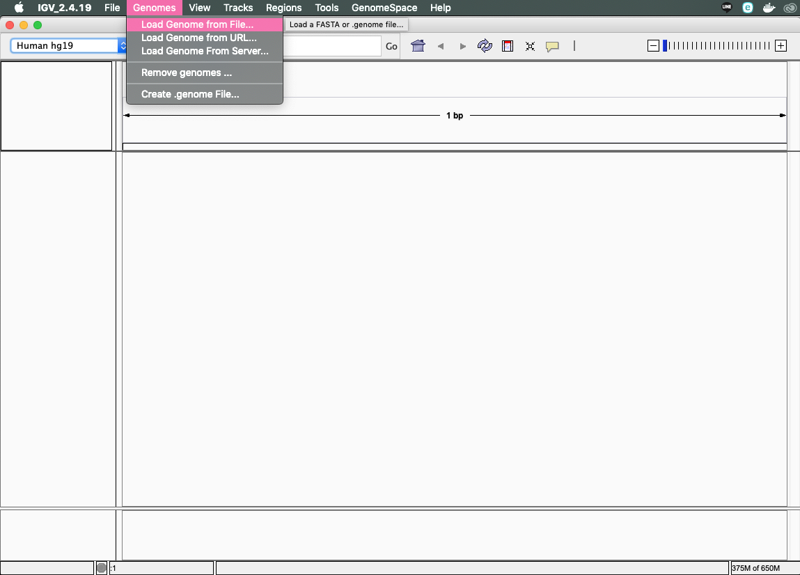

# ゲノムのマッピング

## BWAを用いてリードを参照配列にマッピング

[BWA](http://bio-bwa.sourceforge.net/)は、Burrows-Wheeler Transformation アルゴリズムを用いた高速な配列マッピングを実現しています。Illuminaシーケンサーのショートリードについては様々なマッピングツールがありますが、MinIONなどのロングリードに対応したツールはまだ少なめです。

`bwa`コマンドはよく使われており十分に高速なのですが、他にも産総研の[LAST](http://last.cbrc.jp/)もロングリードに対応しているほか、東大で開発されている[minialign](https://github.com/ocxtal/minialign)はより高速で正確と謳われており、国内のバイオインフォマティクス研究者の活躍にも期待したいところです。

### BWAコマンドの使い方

`bwa`でMinIONのロングリードをマッピングするには、サブコマンド`bwasw`を利用します。コマンドラインオプションは下記のようになります。

```sh
bwa bwasw リファレンス配列名 入力FASTQファイル > 出力SAMファイル
```

マッピング対象とするリファレンス配列は、あらかじめ準備しておく必要があります。今回は、デスクトップの、`GenomeBento`の中の`databases`フォルダ以下に置いてあります。

```
GenomeBento/databases
|-- genomes
|   |-- banana
|   |-- cabbage
|   |-- carrot
|   |-- chickpea
|   |-- hakusai
|   |-- human
|   |-- rice
|   `-- tomato
`-- rbcL
    |-- rbcL_all
    `-- rbcL_bento
```

実際はそれぞれ、`.amb`, `.ann`, `.bwt`, `.pac`, `.sa` の拡張子がついたファイルの組になります。

これらのファイルの作り方に興味のある方は、[リファレンス配列の準備](Genome_preparation.md)を参照してください。

## リファレンス配列へのマッピング

今回のゲノム弁当からMinIONで読んだDNA配列データは、デスクトップの`MinION`フォルダ以下に置いてあります。`fast5`とは[HDF5](https://www.hdfgroup.org/downloads/hdf5/)という複雑かつ大規模なデータを格納できるファイル形式を用いた、MinIONシーケンサーの出力する生データになります。

このままでは取り扱いが難しいため、DNA配列と配列のクオリティを4行ずつに束ねた`FASTQ`形式に変換されたものを利用します。以前は[poretools](https://poretools.readthedocs.io/)を使って自分で変換する必要がありましたが、今のMinIONについてくるMinKNOWソフトウェアは自動でFASTQファイルを生成してくれるようになっています。このうち、`fast5_fail`と`fastq_fail`は何らかの理由で解読に失敗したデータなので割愛します。また前述のように`fast5_pass`もHDF5形式のバイナリデータのため今回は割愛します。`sequencing_summary`にはシーケンシングの実行ログが記録されています。

今回は、`1_hakusai`と`5_hiyokomame`がゲノムをまるごとシーケンスしたデータ、`2_ninjin`, `3_tsukemono`, `4_takikomigohan`, `6_tomato`がPCRをかけて`rbcL`遺伝子領域だけを増幅したものになっています。

```
MinION
|-- 1_hakusai
|   `-- 20190301_1336_MN21603_FAK44689_d305e2cb
|       |-- fast5_fail
|       |-- fast5_pass
|       |-- fastq_fail
|       |-- fastq_pass
|       |   |-- FAK44689_c23e7ecf3758750d90215871e80bac6c68c94336_0.fastq
|       |   |-- FAK44689_c23e7ecf3758750d90215871e80bac6c68c94336_1.fastq
|       |   |-- FAK44689_c23e7ecf3758750d90215871e80bac6c68c94336_2.fastq
|       |   |-- FAK44689_c23e7ecf3758750d90215871e80bac6c68c94336_3.fastq
|       |   |-- FAK44689_c23e7ecf3758750d90215871e80bac6c68c94336_4.fastq
|       |   |-- FAK44689_c23e7ecf3758750d90215871e80bac6c68c94336_5.fastq
|       |   `-- FAK44689_c23e7ecf3758750d90215871e80bac6c68c94336_6.fastq
|       `-- sequencing_summary
|-- 2_ninjin
|-- 3_tsukemono
|-- 4_takikomigohan
|-- 5_hiyokomame
|   `-- 20190301_1334_MN21672_FAK41983_f5af709e
|       |-- fast5_fail
|       |-- fast5_pass
|       |-- fastq_fail
|       |-- fastq_pass
|       |   |-- FAK41983_305c4f329d6b4d936004adebf09704b49e0eb992_0.fastq
|       |   |-- FAK41983_305c4f329d6b4d936004adebf09704b49e0eb992_1.fastq
|       |   |-- FAK41983_305c4f329d6b4d936004adebf09704b49e0eb992_2.fastq
|       |   |-- FAK41983_305c4f329d6b4d936004adebf09704b49e0eb992_3.fastq
|       |   `-- FAK41983_305c4f329d6b4d936004adebf09704b49e0eb992_4.fastq
|       `-- sequencing_summary
`-- 6_tomato
```

### FASTQファイルの構造


### 白菜とヒヨコ豆のリードをマッピング

ゲノムDNAをシーケンスした、`1_hakusai`と`5_hiyokomame`のリードをそれぞれ白菜とヒヨコ豆のリファレンスゲノム配列にマッピングしてみます。

なお、ディレクトリ名やファイル名に`*`を含めると、そこにある全てのファイルにマッチするので、長い名前を省略したり、同じ名前で始まるファイルをまとめて指定することができます。また途中まで入力してTabキー(Macだと`->|`キー)を押すと、長いファイル名も自動的に補完されるので、タイプ量を減らすことができます。

#### 白菜の場合

ターミナルを起動し、デスクトップフォルダ`~/Desktop`（今回シーケンスに使ったMacの場合`/Users/ycam/Desktop`に相当します）に移動して、`bwa`コマンドを実行します。リファレンス配列は`GenomeBento/databases/genomes`フォルダに用意した`hakusai`を、マッピングするファイルは`MinION/1_hakusai`のフォルダの中の`fastq_pass`にある全てのFASTQファイル`*.fastq`を指定しています。

```sh
cd ~/Desktop
bwa bwasw GenomeBento/databases/genomes/hakusai MinION/1_hakusai/20190301*/fastq_pass/*.fastq > hakusai.sam
```

なお、`bwa`コマンドが見つからない場合、パスが通ったところにインストールされていない可能性があります。今回は`GenomeBento`フォルダの中にも`bwa`コマンドを入れてありますので、`./GenomeBento/bwa`のように書き換えると実行できるはずです。

```sh
cd ~/Desktop
./GenomeBento/bwa bwasw GenomeBento/databases/genomes/hakusai MinION/1_hakusai/20190301*/fastq_pass/*.fastq > hakusai.sam
```

#### ヒヨコ豆の場合

ヒヨコ豆のデータを使う場合はデータベース名を`chickpea`に変更し、FASTQファイルは`MinION/5_hiyokomame`以下にあるものを使います。

```sh
cd ~/Desktop
bwa bwasw GenomeBento/databases/genomes/chickpea MinION/5_hiyokomame/20190301*/fastq_pass/*.fastq > chickpea.sam
```

ヒヨコ豆の場合、以下の説明では`hakusai`を`chickpea`に読み替えてください。

### SAMファイルの構造


## IGVを使ってマッピング結果を見てみる

[IGV](http://software.broadinstitute.org/software/igv/)は、米国Broad Instituteで開発されているゲノムブラウザです。リファレンスゲノムおよびマッピングされたリードを表示することができ、ヒトゲノムのように巨大なゲノムにも対応しています。

### IGVを起動 (Dockのアイコンをクリック)


はじめて起動した場合、ヒトゲノムのバージョンhg19が選ばれた状態になっています。


### リファレンスゲノム配列を読み込む

他の生物種のゲノムに切り替えるためには、IGVのGenomesメニューから「Load Genome from File...」を選択します。



白菜だったら`3711-hakusai.genome`など、各グループで読んだ対象の食材の`.genome`ファイルを選択してOpenをクリックします。


読み込めたらこのようにメニューから白菜の各染色体に相当するDNA配列がメニューに出てきます。


ここで読み込んだ`hakusai.genome`のような`.genome`ファイルの作り方に興味のある方は、[IGV用.genomeファイルの準備](IGV_preparation.md)をご参照ください。

### SAMファイルのソートとインデックス作成

`SAM`ファイルは、できたままだとマッピングされたリードがゲノム座標順に並んでいないので、ゲノムブラウザで見る際に効率が悪くなります。このため、通常はソートしてインデックス作成したものを利用します。後述の`samtools`でもできますが、ここではIGVに内蔵されている`igvtools`を使ってみます。

#### igvtoolsの起動

Toolsメニューから「Run igvtools...」を選んで`igvtools`を起動します。


#### igvtoolsでのソート

Commandを`Sort`に変更して、Input Fileの`Browse`ボタンをクリックして、作成した`hakusai.sam`を選択します。


`Run`ボタンでソートを実行すると`hakusai.sorted.sam`のように名前に`.sorted`がついたSAMファイルができます。Doneと表示されれば完了です（わりと一瞬で終わるかと思います）。


#### igvtoolsでのインデックス作成

Commandを`Index`に変更して、この`hakusai.sorted.sam`ファイルに高速化のためのインデックスを作成します（`Sort`から`Index`に変更しただけだと`hakusai.sorted.sam`ではなく元の`hakusai.sam`ファイルが選ばれている可能性があるので注意）。


結果、元の`hakusai.sam`ファイルに対して、ソートされた`hakusai.sorted.sam`ファイルと、インデックスファイル`hakusai.sorted.sam.sai`ができます。

### マッピングの結果を読み込む

「Load from File...」から、作成した`hakusai.sorted.sam`ファイルを選択します。


あとはズームしていくと、マッピングされたリードが出てきます。


リードの数が少ない場合、マップされた領域を探すのがちょっと大変ですが、SAMファイルの中を見ると配列ごとにマッピングされた座標が分かるのでヒントになります。このことから、ゲノムを完全に読むには大量にシーケンスする必要があることが分かると思います。


## BAMファイルの作成とマップ率の確認

BAMファイルはSAMファイルをバイナリにして、省スペース化および高速化をはかるためのフォーマットです。SAMファイルをBAMファイルに変換するには[samtools](http://samtools.sourceforge.net/)を使います。`samtools`を使うと、リードのマッピング率なども調べることができます。

### BAM形式に変換

```sh
samtools view -bS hakusai.sam > hakusai.bam
```

### 染色体上の座標でソートする

```sh
samtools sort hakusai.bam hakusai.sorted
```
### インデックスを作成

```sh
samtools index hakusai.sorted.bam
```

### マッピングの状況を見てみる

```sh
samtools flagstat hakusai.sorted.bam
```

今回の白菜の例では下記のような結果になりました。

```
% samtools flagstat hakusai.sorted.bam
9051 + 0 in total (QC-passed reads + QC-failed reads)
0 + 0 duplicates
6067 + 0 mapped (67.03%:nan%)
6067 + 0 paired in sequencing
2999 + 0 read1
3068 + 0 read2
0 + 0 properly paired (0.00%:nan%)
3844 + 0 with itself and mate mapped
2223 + 0 singletons (36.64%:nan%)
3422 + 0 with mate mapped to a different chr
2349 + 0 with mate mapped to a different chr (mapQ>=5)
```

67%のリードがマッピングされたということで、なかなか良かったのではないでしょうか。
