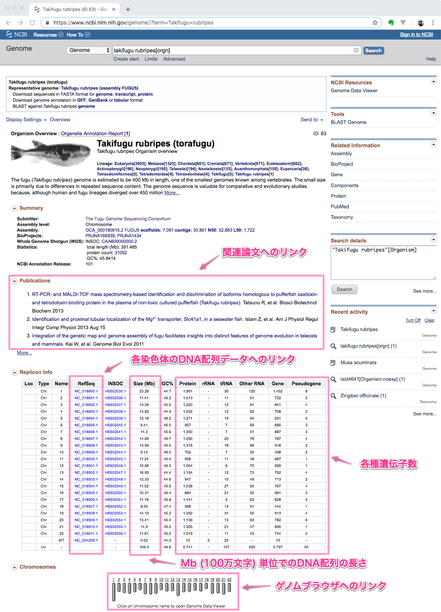
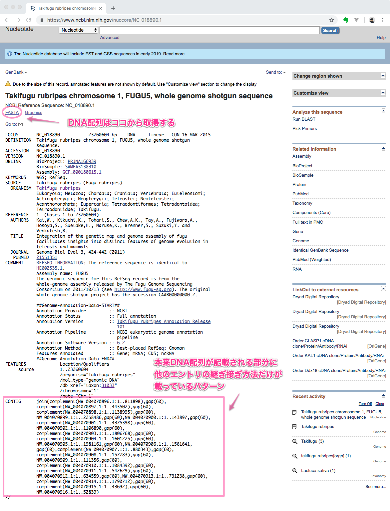

# リファレンス配列の準備

自分でリファレンス配列のファイルを作る場合は、ゲノム弁当の[食材の追加方法](AdditionalGenomeBento.md)で紹介したように、たとえばNCBI Genomeなどでゲノム配列データのIDを取得します。



ただし、[ココ](https://www.ncbi.nlm.nih.gov/genome/63)の「各染色体のDNA配列データへのリンク」をクリックした先にあるトラフグの[染色体１番](https://www.ncbi.nlm.nih.gov/nuccore/NC_018890.1)のRefSeqデータベースエントリ`NC_018890.1`には、ゲノム配列自体は含まれていません。



左上の「FASTA」と書かれたリンクをクリックすると配列データをダウンロードできます。トラフグの全ゲノムを取得するには、この操作を全ての染色体の数ほど繰り返して一つのファイルにまとめます。この作業はちょっと面倒なので、たとえば拙作の[TogoWS](http://togows.org/)を使って工夫してみます。

```sh
for id in NC_018890.1 NC_018891.1 NC_018892.1 NC_018893.1 NC_018894.1 NC_018895.1 NC_018896.1 NC_018897.1 NC_018898.1 NC_018899.1 NC_018900.1 NC_018901.1 NC_018902.1 NC_018903.1 NC_018904.1 NC_018905.1 NC_018906.1 NC_018907.1 NC_018908.1 NC_018909.1 NC_018910.1 NC_018911.1 NC_004299.1
do
  curl http://togows.org/entry/nucleotide/${id}.fasta >> 31033-torafugu.fasta
done
```

少し時間がかかりますが、これで指定したトラフグの各染色体のゲノムDNA配列がすべて一発で`31033-torafugu.fasta`ファイルにFASTA形式でダウンロードできます。

ゲノム配列が入ったFASTAファイルに対し、`bwa index`コマンドを用いてインデックスを作ります。このとき`-p`オプションで`bwa bwasw`にオプションで渡すリファレンス配列名を指定します（FASTAファイル名、リファレンス配列名は自由に決めて構いません）。

```sh
bwa index -p torafugu 31033-torafugu.fasta
```

このようにして作ったのが、今回ゲノム弁当の解析用に用意した上記の`banana`, `cabbage`, `carrot`, `chickpea`, `hakusai`, `rice`, `tomato`などになります。なお、`human`に関しては東北メディカル・メガバンク機構から[2019年2月25日に公開されたばかり](https://www.megabank.tohoku.ac.jp/news/32217)の[日本人のリファレンスゲノム配列JG1](https://jmorp.megabank.tohoku.ac.jp/201902/downloads/)です。実験の途中に間違って自分のDNAが入ってしまって（コンタミして）いないか、確認のために使うことができると思います。
