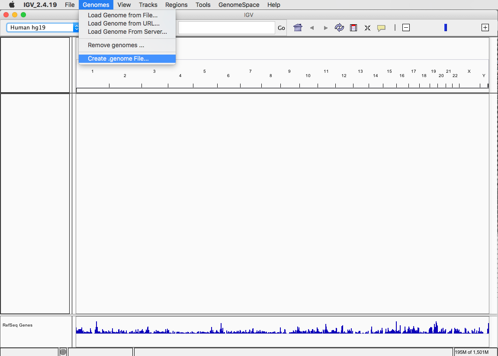

# リファレンス配列の準備

自分でリファレンス配列のファイルを作る場合は、ゲノム弁当の[食材の追加方法](AdditionalGenomeBento.md)で紹介したように、まずは NCBI Genome などを使って DNA 配列データの ID を取得します。


ただし、[Replicon Info の表](https://www.ncbi.nlm.nih.gov/genome/63)の RefSeq カラムに書かれている「各染色体の DNA 配列データへのリンク」をクリックしても、その先にあるトラフグの[染色体１番](https://www.ncbi.nlm.nih.gov/nuccore/NC_018890.1)の RefSeq データベースエントリ `NC_018890.1` にはデフォルトでは DNA 配列自体は表示されていません。ここでさらに左上の「FASTA」と書かれたリンクをクリックすることで染色体１番の DNA 配列データをダウンロードできます。


トラフグの全ゲノムを取得するには、この操作を全ての染色体の数ほど繰り返して一つのファイルにまとめます。この作業はちょっと面倒なので、たとえば [DBCLS](https://dbcls.rois.ac.jp/) で提供されている [TogoWS](http://togows.org/) サービスを使って工夫してみます。

```sh
for id in NC_018890.1 NC_018891.1 NC_018892.1 NC_018893.1 NC_018894.1 NC_018895.1 NC_018896.1 NC_018897.1 NC_018898.1 NC_018899.1 NC_018900.1 NC_018901.1 NC_018902.1 NC_018903.1 NC_018904.1 NC_018905.1 NC_018906.1 NC_018907.1 NC_018908.1 NC_018909.1 NC_018910.1 NC_018911.1 NC_004299.1
do
  curl http://togows.org/entry/nucleotide/${id}.fasta >> 31033-torafugu.fasta
done
```

少し時間がかかりますが、これで指定したトラフグの各染色体のゲノム DNA 配列がすべて一発で `31033-torafugu.fasta` ファイルにFASTA形式でダウンロードできます。

ゲノム配列が入ったFASTAファイルに対し、`bwa index` コマンドを用いてインデックスを作ります。このとき `-p` オプションで `bwa` にオプションで渡すリファレンス配列名を指定します（FASTA ファイル名、リファレンス配列名は自由に決めて構いません）。

```sh
bwa index -p torafugu 31033-torafugu.fasta
```

このようにして作ったのが、今回ゲノム弁当の解析用に用意した `banana`, `cabbage`, `carrot`, `chickpea`, `hakusai`, `rice`, `tomato` などのリファレンス配列になります。なお、`human`に関しては東北メディカル・メガバンク機構から[2019年2月25日に公開されたばかり](https://www.megabank.tohoku.ac.jp/news/32217)の[日本人のリファレンスゲノム配列JG1](https://jmorp.megabank.tohoku.ac.jp/201902/downloads/)です。実験の途中に間違って自分の DNA が入ってしまって（コンタミして）いないか、確認のために使うことができると思います。

## ゲノム配列の ID と DNA 配列の取得 API 例

ゲノム配列を取得したい生物種が多い場合、各染色体のゲノム配列に相当する ID のリストを作成するのも手間です。このため、指定した Taxonomy ID の RefSeq エントリを表示する API を用意してみました。

* http://togogenome.org/sparqlist/tax2refseq

これを使うとトラフグの Taxonomy ID である `31033` を引数に渡して、ゲノム配列 ID のリストを取得したり、実際に DNA 配列を取得することができます。

この API は、デフォルトでは JSON で ID のリストを取得します。

```sh
curl 'http://togogenome.org/sparqlist/api/tax2refseq?tax=31033'
[
  "NC_004299.1",
  "NC_018890.1",
  "NC_018891.1",
  "NC_018892.1",
  "NC_018893.1",
  "NC_018894.1",
  "NC_018895.1",
  "NC_018896.1",
  "NC_018897.1",
  "NC_018898.1",
  "NC_018899.1",
  "NC_018900.1",
  "NC_018901.1",
  "NC_018902.1",
  "NC_018903.1",
  "NC_018904.1",
  "NC_018905.1",
  "NC_018906.1",
  "NC_018907.1",
  "NC_018908.1",
  "NC_018909.1",
  "NC_018910.1",
  "NC_018911.1"
]
```

テキストで取得した場合、配列取得のためのコマンドを出力するようにしてあります。

```sh
curl -H 'Accept: text/plain' 'http://togogenome.org/sparqlist/api/tax2refseq?tax=31033'
curl http://togows.org/entry/nucleotide/NC_004299.1.fasta >> 31033.fasta
curl http://togows.org/entry/nucleotide/NC_018890.1.fasta >> 31033.fasta
curl http://togows.org/entry/nucleotide/NC_018891.1.fasta >> 31033.fasta
curl http://togows.org/entry/nucleotide/NC_018892.1.fasta >> 31033.fasta
curl http://togows.org/entry/nucleotide/NC_018893.1.fasta >> 31033.fasta
curl http://togows.org/entry/nucleotide/NC_018894.1.fasta >> 31033.fasta
curl http://togows.org/entry/nucleotide/NC_018895.1.fasta >> 31033.fasta
curl http://togows.org/entry/nucleotide/NC_018896.1.fasta >> 31033.fasta
curl http://togows.org/entry/nucleotide/NC_018897.1.fasta >> 31033.fasta
curl http://togows.org/entry/nucleotide/NC_018898.1.fasta >> 31033.fasta
curl http://togows.org/entry/nucleotide/NC_018899.1.fasta >> 31033.fasta
curl http://togows.org/entry/nucleotide/NC_018900.1.fasta >> 31033.fasta
curl http://togows.org/entry/nucleotide/NC_018901.1.fasta >> 31033.fasta
curl http://togows.org/entry/nucleotide/NC_018902.1.fasta >> 31033.fasta
curl http://togows.org/entry/nucleotide/NC_018903.1.fasta >> 31033.fasta
curl http://togows.org/entry/nucleotide/NC_018904.1.fasta >> 31033.fasta
curl http://togows.org/entry/nucleotide/NC_018905.1.fasta >> 31033.fasta
curl http://togows.org/entry/nucleotide/NC_018906.1.fasta >> 31033.fasta
curl http://togows.org/entry/nucleotide/NC_018907.1.fasta >> 31033.fasta
curl http://togows.org/entry/nucleotide/NC_018908.1.fasta >> 31033.fasta
curl http://togows.org/entry/nucleotide/NC_018909.1.fasta >> 31033.fasta
curl http://togows.org/entry/nucleotide/NC_018910.1.fasta >> 31033.fasta
curl http://togows.org/entry/nucleotide/NC_018911.1.fasta >> 31033.fasta
```

このため、出力結果をシェルに渡すことで指定した生物の全ゲノムを一度に取得することができます。

```sh
curl -H 'Accept: text/plain' 'http://togogenome.org/sparqlist/api/tax2refseq?tax=31033' | sh
```

## 食材ゲノム FASTA ファイルの準備

これを利用すると、今回使う食材のゲノム FASTA ファイルを比較的簡単に用意することができます。

```sh
curl 'http://togogenome.org/sparqlist/api/tax2refseq.text?tax=3711' | sh
mv 3711.fasta databases/genomes/3711-hakusai.fasta

curl 'http://togogenome.org/sparqlist/api/tax2refseq.text?tax=3827' | sh
mv 3827.fasta databases/genomes/3827-chickpea.fasta

curl 'http://togogenome.org/sparqlist/api/tax2refseq.text?tax=4081' | sh
mv 79200.fasta databases/genomes/4081-tomato.fasta

curl 'http://togogenome.org/sparqlist/api/tax2refseq.text?tax=79200' | sh
mv 79200.fasta databases/genomes/79200-carrot.fasta
```

なお、ゲノムの配列ファイルは `databases/genomes/` に置いておくことにします。

## IGV 用 .genome ファイルの作成

今回 IGV で読み込むときに使う `hakusai.genome` のような `.genome` ファイルは、上記の方法で用意したゲノム配列の FASTA ファイル `3711-hakusai.fasta` などからIGVを使って作ることができます。

このためには `IGV` の `Genomes` メニューから「Create .genome File...」を選びます。



つぎに、「FASTA file」に `3711-hakusai.fasta` など `FASTA` ファイルを指定し、「Unique identifier」に個別の ID（ここでは白菜の Taxonomy ID である 3711 を流用しました）および「Descriptive name」に名前をつけます（この名前が IGV のメニューに表示されます）。


`OK` を押して `.genome` ファイルの保存先を指定します。


今回は、元の FASTA ファイル `3711-hakusai.fasta` があるのと同じ `databases/genomes/` ディレクトリ内に、`3711-hakusai.genome` という名前で保存しています。同様に、他のリファレンス配列についても`.genome`ファイルを事前に用意しました。
