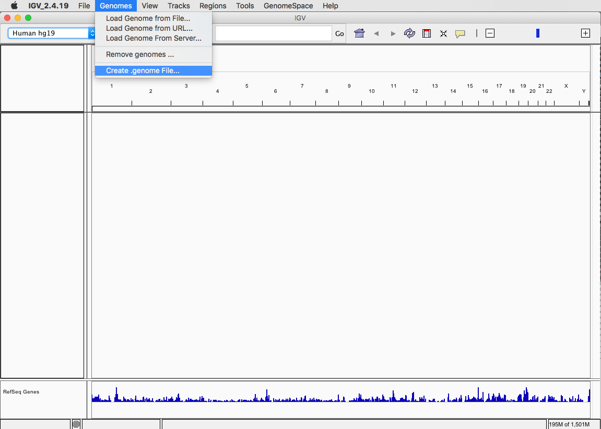
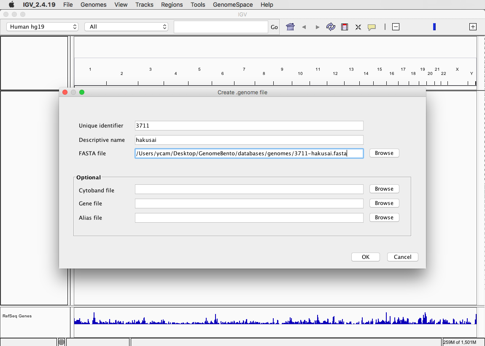
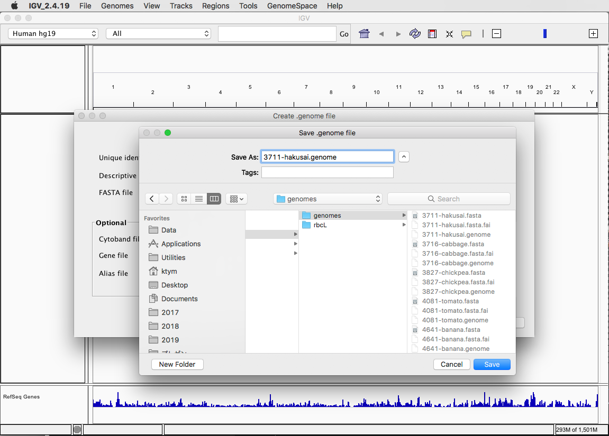

# IGV用.genomeファイルの作成

今回IGVで読み込んだ`hakusai.genome`のような`.genome`ファイルは、[事前に用意](Genome_preparation.md)したゲノム配列のFASTAファイル`3711-hakusai.fasta`などからIGVを使って作ることができます。

このためにはGenomesメニューから「Create .genome File...」を選びます。

つぎに、「FASTA file」に`3711-hakusai.fasta`などのFASTAファイルを指定し、「Unique identifier」に個別のID（ここでは白菜のタクソノミーIDである3711を流用しました）および「Descriptive name」に名前をつけます（この名前がIGVのメニューに表示されます）。

OKを押して`.genome`ファイルの保存先を指定します。

ここでは元のFASTAファイル`3711-hakusai.fasta`があったのと同じ`GenomeBento/databases/genomes`ディレクトリ内に、`3711-hakusai.genome`という名前で保存しています。今回は、このようにして他のリファレンス配列についても`.genome`ファイルを事前に用意してあります。
