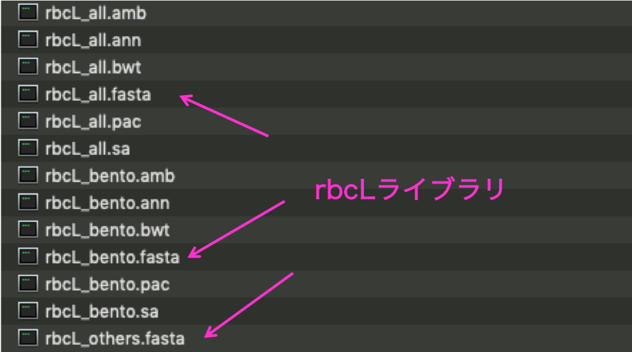
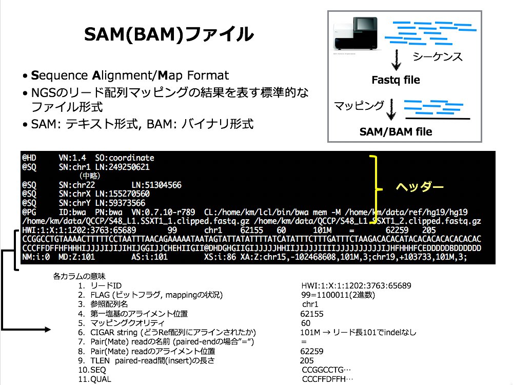

# rbcL によるメタ植物ゲノム解析

料理には様々な食材がありますが、今回は食材に含まれる野菜のゲノム DNA 中から rbcL 遺伝子の領域だけを PCR で増幅して、ゲノム弁当に含まれているはずの食材が検出できるか試してみます。この rbcL は植物が二酸化炭素から炭素を固定するルビスコ (rubisco) という大変重要な酵素の大サブユニット (large subunit) を構成する遺伝子で、正確には「リブロース1,5-ビスリン酸カルボキシラーゼ/オキシゲナーゼ」英語では「ribulose 1,5-bisphosphate carboxylase/oxygenase (を略してRuBisCO)」というそうです。なお rbcL は核ゲノムではなく、葉緑体ゲノムに含まれる遺伝子で、全ての植物から見つかるため、DNA による植物種検出のバーコードとして利用されています。ルビスコの立体構造についての解説や、酵素の働きが鈍いため葉緑体には大量のルビスコが含まれており、その結果世界で一番豊富に存在する酵素となっている、といった興味深い話は [PDBj 今月の分子 011](https://pdbj.org/mom/11) で読むことができます。

## 植物 rbcL 遺伝子の配列ライブラリ

今回 PCR で増幅した [rbcL 遺伝子領域の DNA 配列を GenBank などの網羅的な塩基配列データベースから検索](https://www.ncbi.nlm.nih.gov/nuccore/?term=rbcL) して取り出すことも可能ですが、キーワードでの検索だと一部分だけの DNA 配列や、データが間違っているもの、たまたま同じ名前が含まれているものなど、ゴミが混じってくることが考えられます。

そこで、今回は下記の論文より、8万7千種の植物から集められた rbcL 遺伝子の配列データセットを利用することにします。

* An rbcL reference library to aid in the identification of plant species mixtures by DNA metabarcoding.
  * Bell KL, Loeffler VM, Brosi BJ.
  * Appl Plant Sci. 2017 Mar 10;5(3). pii: apps.1600110. doi: 10.3732/apps.1600110. eCollection 2017 Mar.
  * https://www.ncbi.nlm.nih.gov/pubmed/28337390

## リードの rbcL ライブラリへのマッピング

デスクトップの `GenomeBento` フォルダ内の `databases/rbcL/` に必要なデータファイルがあります。



このなかの `rbcL_all.fasta` ファイルを使って、`minimap2` コマンドで rbcL ライブラリに MinION で読んだリードをマッピングしてみましょう。

ターミナルを起動し、`~/Desktop/GenomeBento` ディレクトリ（今回シーケンスに使った Mac の場合 `/Users/ycam/Desktop/GenomeBento` に相当します）に移動して、`minimap2` コマンドを実行します。

出力を `SAM` 形式にするため `-a` オプションをつけ、マッピング対象となる `FASTA` ファイルとマッピングする `FASTQ` ファイルを順番に指定します。結果は `mappings` フォルダの中に保存することにしました。

```sh
cd ~/Desktop/GenomeBento
./tools/minimap2 -a databases/rbcL/rbcL_all.fasta samples/1_hakusai.fastq       > mappings/1_hakusai_rbcL.sam
./tools/minimap2 -a databases/rbcL/rbcL_all.fasta samples/2_ninjin.fastq        > mappings/2_ninjin_rbcL.sam
./tools/minimap2 -a databases/rbcL/rbcL_all.fasta samples/3_tsukemono.fastq     > mappings/3_tsukemono_rbcL.sam
./tools/minimap2 -a databases/rbcL/rbcL_all.fasta samples/4_takikomigohan.fastq > mappings/4_takikomigohan_rbcL.sam
./tools/minimap2 -a databases/rbcL/rbcL_all.fasta samples/5_hiyokomame.fastq    > mappings/5_hiyokomame_rbcL.sam
./tools/minimap2 -a databases/rbcL/rbcL_all.fasta samples/6_tomato.fastq        > mappings/6_tomato_rbcL.sam
```

それではマッピング結果を見てみましょう。じつは、結果が見やすいように `rbcL_all.fasta` ファイルでは、ゲノム食材についてだけ学名の前に `YCAMGB_日本語名_` という名前をつけておきました。またそれぞれの `SAM` ファイルで、各配列がどの生物種に似ていたかを数える簡単なスクリプト `check.sh` を用意しておきました。これを使って、

```sh
./tools/check.sh mappings/3_tsukemono_rbcL.sam | less
```

のようにすると、似ていた配列が多い順にすべての結果が表示されます。ゲノム食材だけに絞って見たい場合は、`YCAMGB_` という名前で始まっている行だけ検索すれば良いので、`grep` コマンドを使って下記のように実行します。

```sh
./tools/check.sh mappings/3_tsukemono_rbcL.sam | grep YCAMGB
```

ただし、日本語名と学名の対応は機械的に行いましたので、完璧ではありません。

### SAM ファイルの構造

SAM ファイルは、各リードがどの配列のどこにマッピングされたかが記載されており、少し複雑な形式をしています。上記のスクリプトでは、次の図の３カラム目にある参照配列名のところを切り出して集計しています。



## 結果の解釈

TODO: 追記する
