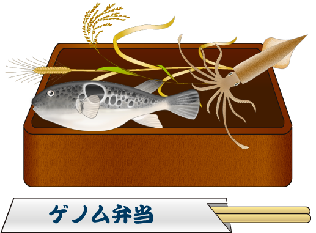

# YCAM InterLab Camp vol.3

（画像は https://togotv.dbcls.jp/togopic.2013.18.html より）

2019年3月2日、[YCAM InterLab Camp vol.3](https://www.ycam.jp/events/2019/ycam-interlab-camp-vol3/) では、ゲノム弁当を素材として、その食材に含まれる DNA を [MinION](https://nanoporetech.com/products/minion) シーケンサーで解読し、データベースを使って解読した DNA 配列がどの生物由来のものか検索する実習を行いました。

詳しいレポートが [Make:](https://makezine.jp/blog/2019/03/ycaminterlabcamp3_part1.html) に掲載されているのでぜひご参照ください。

## ゲノム弁当解読プロジェクト

[イントロダクション](Introduction.md) ([PDF](slides/Introduction.pdf))

参考資料
* [クマムシゲノム解読の話](slides/Kumamushi.pdf)
* ゲノム医科学への応用の話 (to be uploaded)

## MinION で読んだ DNA 配列を見てみよう

* [MinION で得られた DNA 配列の確認](Sequence_data.md)
* [リファレンス配列の準備](Genome_preparation.md)
* [リードマッピングの準備](Installation.md)
* [rbcL のメタ植物ゲノム解析](Metagenome_analysis.md)
* [リファレンス配列へのマッピング](Genome_analysis.md)
* [おまけの解析](Homework.md)

## 今回準備して頂いたゲノム弁当のサンプル

料理（9種類）

* れんこんひよこ豆味噌煮（れんこん、ひよこ豆、ひよこ豆味噌、のり）
* **炊き込みごはんの具**（大根、にんじん、しめじ、ひえしょうゆ、ごま油）
* コロッケの中身（さつまいも、ひよこ豆味噌）
* **漬物 甘酢漬け**（白菜、大根、水菜、酢（米）、砂糖（てんさい））
* きのこスープ
* ゲノムソース（味噌、アーモンド、しょうゆ、唐辛子、砂糖、ごま）
* きのこ豆腐ハンバーグ タネ
* オムレツ（玉子、じゃが芋、玉ねぎ、豆乳、オリーブ油）
* 人参サラダ（人参、キヌア、オリーブオイル、マスタードシード、くるみ、高菜）

食材（14種類）

* **トマト**
* しめじ
* 大根
* かぶ
* **人参**
* じゃが芋
* 玉ねぎ
* レンコン
* ほうれん草
* **白菜**
* キャベツ
* 黒米
* キヌア
* **ひよこ豆**

うち、**太字** は `MinION` でのシーケンスにつかったもの。

## ゲノム弁当の食材を充実させよう

「この食材のゲノムはまだ決まっていないのかな？」と思ったら、
[食材の追加方法](AdditionalGenomeBento.md)を見て探してみましょう。

## 参考文献

* [よくわかるバイオインフォマティクス入門](https://www.amazon.co.jp/dp/4065138213/)
