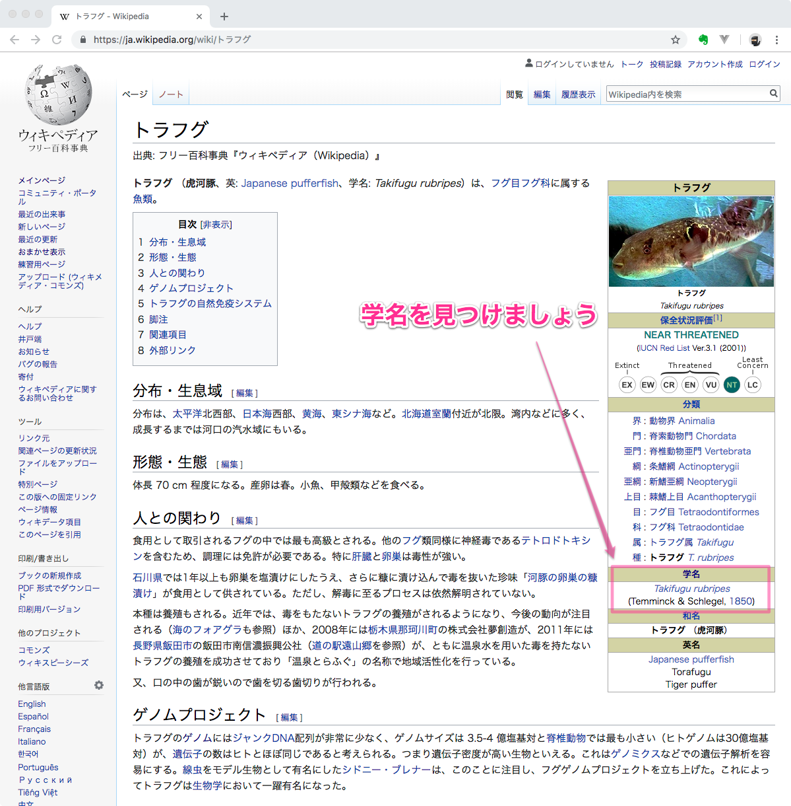
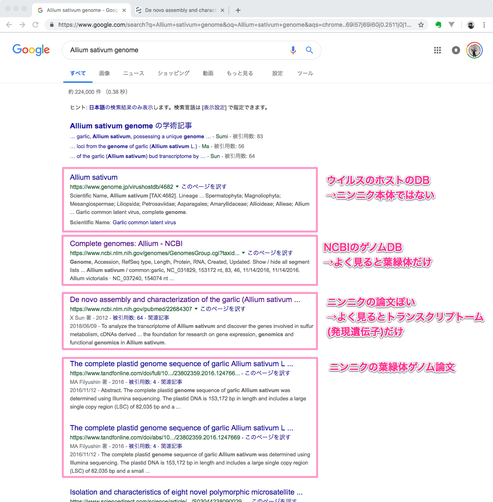
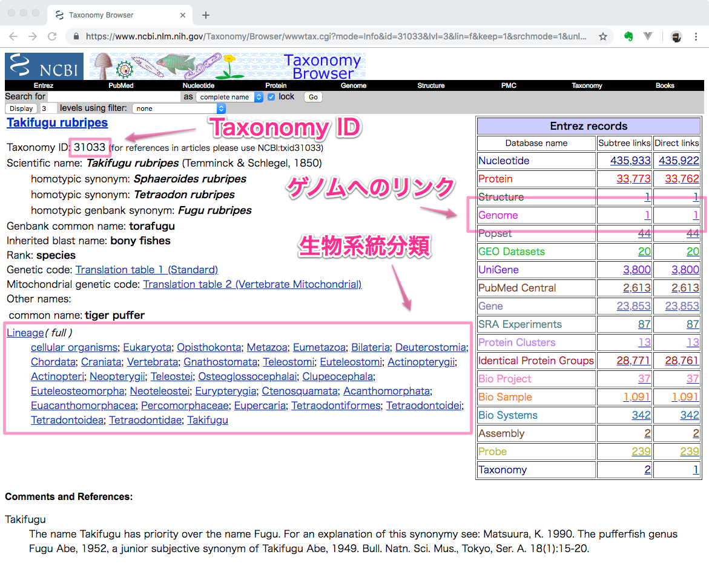
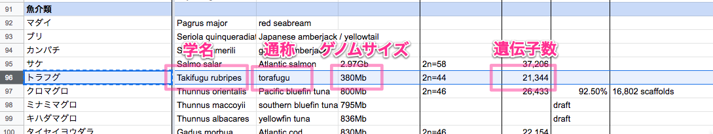
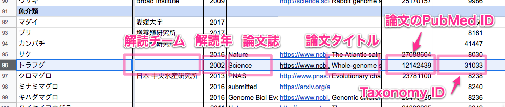

# ToyToyさんを救え！

## 未来のゲノム弁当食材の追加のしかた

「この食材のゲノムはまだ決まっていないのかな？」と思ったら、

[ゲノム弁当 - Google スプレッドシート](https://docs.google.com/spreadsheets/d/1iyh41eZSsOWCkZOS0b5iqjZM4jA6osboCqXFHqVtLx8/edit#gid=335143120)

を開いて探してみてください。

載ってなかったからといって、本当に世界中で誰もその食材のゲノムを読んでいないかどうかはまだわかりません。

### Step 1: Wikipediaなどで食材の学名を検索

今回は、例として（すでにゲノムが決まっていますが）山口の食材として有名な「トラフグ」を検索してみます。右上のインフォボックスの中から学名を見つけます。

トラフグの学名は Takifugu rubripes であることが分かりました。

### Step 2: 論文データベースPubMedを検索

PubMedは生命医科学論文のほとんどを集積したデータベースです。
これを使って、トラフグのゲノム解読の論文が出ているかどうか調べてみましょう。

ゲノムが決まっている場合、学名と genome、whole genome、draft genome、complete genome、genome assembly などのキーワードで論文が見つかってくることが多いです。

PubMed では新しい論文が先頭に表示されますので、ゲノム論文はページをたどって古い論文を見ていかないと見つからないことが多いです。運が良ければ、Best matches の欄にゲノム論文が選ばれて出てくることもあるでしょう。

もし色々なキーワードで探しても見つからない場合は、Google でも検索してみます。たとえば、スパイシーなゲノム弁当に欲しくなるニンニク Allium sativum L の場合、こんな感じでした。

残念ながら、やはりまだニンニク本体のゲノム論文は出ていないように見えます。

### Step 3: 生物系統分類データベースを検索

[Home - Taxonomy - NCBI](https://www.ncbi.nlm.nih.gov/taxonomy)

で生物種 ID との系統を学名から調べることができます。

これでトラフグのタクソノミー（系統分類）の ID が 31033 であることが分かります。

### Step 4: ゲノム論文とタクソノミー ID を表に追加

もし、新しい食材のゲノムが出ていることが確認できたら、ぜひゲノム弁当の表に追記してください。論文を読んで、ゲノムサイズや遺伝子数、どのチームが解読したかなどが分かればあわせて記載頂けると大変助かります。自信がない場合は DBCLS の片山 <ktym@dbcls.jp> または YCAM の津田さんまでご相談ください。

これで ToyToy さんも安心して新しい食材を加えた、より美味しいお弁当を作ることができるようになります！！

